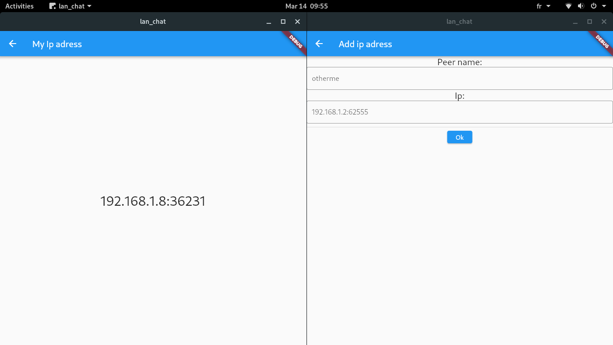

# LanChat

Flutter + Rust demo showcasing how simple the integration is!

## Usage
`./run`

It requires cargo and flutter correctly configured.

## Info

### Simple example

The simplest code is here https://github.com/sigmaSd/LanChat/tree/simple_udp_multicast this shows the rust - flutter integration without unneeded complexity(that comes with addetional features).

It uses only udp multicast for messaging which works great except for android which is hit/miss.

### Current work

The master branch tracks the actual developement.
I uses udp multicast for peer discovery and tcp for the actual communications.

This allows manually adding hosts that are not found automaticlly (android+++).

# Question/Answer

**Q- Sometimes Android is not discoverd**

*A- You can add peer adress manually, on android click on myip pane to see you tcp server adress, on the other peers click add ip and paste that in.*
